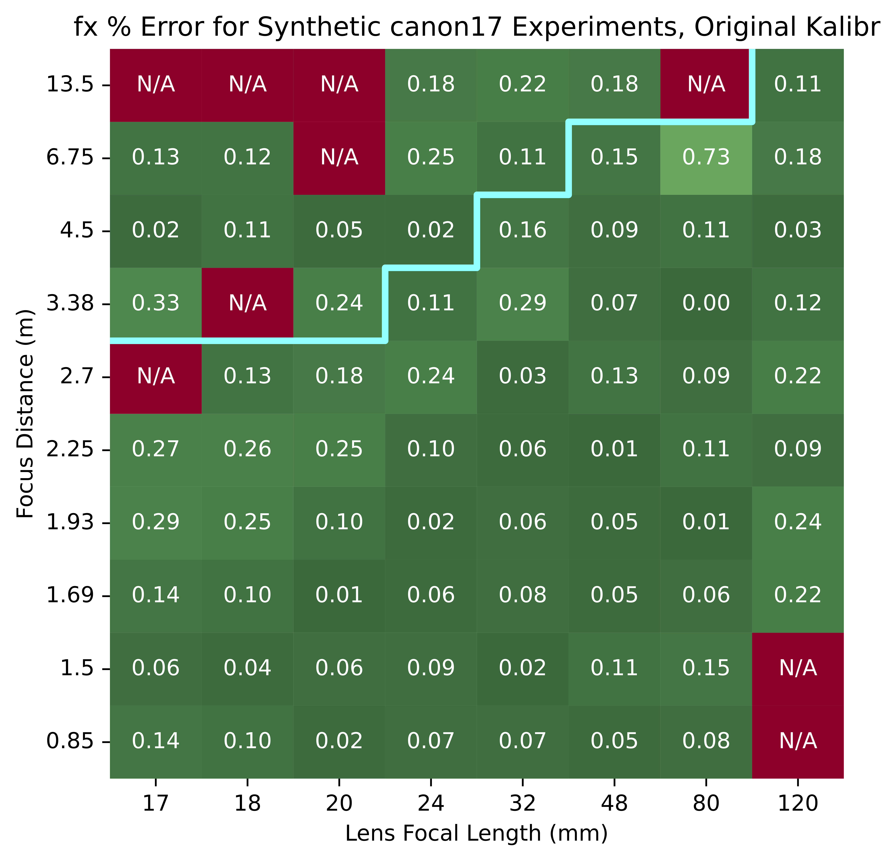
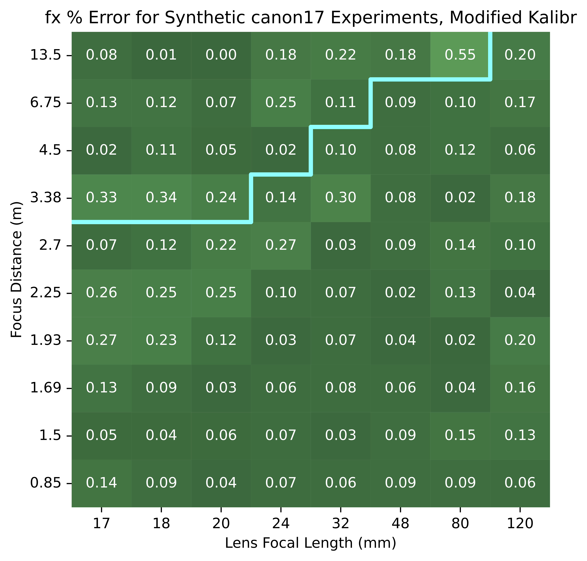

# Kalibr Extension for InFlux

This directory contains the Kalibr extension introduced by [InFlux](https://arxiv.org/abs/2510.23589) for more accurate and robust camera calibration.

The extension is based on the upstream [ETH Zurich ASL Kalibr project](https://github.com/ethz-asl/kalibr). InFlux adds a robust camera intrinsics initialization method, an optional interface for supplying an initial focal length estimate, and support for calibration from general 2D-3D correspondences with known target structure.

<p align="center">
  
  
</p>

<p align="center"><em>Comparison of original Kalibr (left) and the InFlux-modified Kalibr (right) across controlled synthetic camera calibration experiments. The experiments render planar calibration boards and custom targets with known 3D structure under multiple ground truth camera intrinsics settings, run each version of Kalibr on the resulting observations, and compare its focal length and principal point estimates with ground truth. The InFlux modifications reduce convergence failures, improve accuracy, and reduce prediction variance. Figure adapted from Figure 6 of the InFlux paper; see Section 4.3 and Supplementary Section D for experimental details.</em></p>

The documented InFlux path has been validated for a single camera using the `pinhole-radtan` model. Other upstream Kalibr tools, camera models, and multi-sensor workflows remain in the source tree.

## Main InFlux Extensions

### Robust `fixed_point` Initialization

To run camera calibration, Kalibr first creates an initial estimate of camera intrinsics to serve as the starting point for its later full calibration optimization. For the `pinhole-radtan` model, original Kalibr places the principal point at the image center, sets distortion to zero, estimates focal length from the calibration target observations using a vanishing-point-based method, and then runs Levenberg-Marquardt to obtain the initial camera intrinsics used by the rest of the calibration pipeline.

This original initialization path has two important failure modes:

- The vanishing-point-based method may fail to produce a valid focal length estimate.
- Even when it produces a finite estimate, that estimate may be too inaccurate for the following nonlinear optimization. Because this optimization is sensitive to its starting point, a poor initialization can lead to divergent final intrinsics predictions or an implausibly off-center principal point.

InFlux introduces the `fixed_point` initialization procedure to produce a more stable starting point for the later full calibration. It uses two inductive biases that hold for the camera systems targeted by InFlux:

- The principal point should remain near the image center during initialization.
- The horizontal and vertical focal lengths, `fx` and `fy`, should remain close to one another.

Starting from an initial focal length estimate—which may be supplied explicitly or chosen by Kalibr—a centered principal point, and zero distortion, `fixed_point` proceeds as follows:

1. Run four Levenberg-Marquardt intrinsic refinements. After each of the first three refinements, average the estimated `fx` and `fy`, assign that average to both focal length parameters, restore the principal point to the image center, and reset distortion to zero.
2. Run four additional Levenberg-Marquardt intrinsic refinements. After each of the first three refinements, again average `fx` and `fy` and restore the principal point to the image center, but retain the estimated distortion.
3. After the final refinement, average `fx` and `fy` and restore the principal point to the image center one last time.
4. Use the resulting intrinsics and distortion as the initialization for Kalibr's later full calibration optimization.

Each inner refinement still optimizes the active projection and distortion parameters. The robustness comes from repeatedly projecting the intermediate estimates back onto the focal length and principal point priors between refinements, rather than permanently fixing those parameters.

`fixed_point` affects only the initialization stage. The later full calibration optimization may move the final principal point away from the image center when supported by the observations.

### Calibration from General 2D-3D Correspondences

Original Kalibr camera calibration workflows use known planar calibration targets. InFlux extends Kalibr to accept ordered 2D observations of a target with known 3D structure, enabling calibration with non-planar targets.

The extension represents the target as an ordered set of known 3D points and associates it with ordered 2D observations from one or more camera viewpoints, together with validity indicators for missing observations. This relaxation enabled the InFlux pipeline to calibrate from custom 3D targets, including the drone targets used in the paper.

The exact target YAML and correspondence-file formats are documented later in [Option B: Provide General 2D-3D Correspondences](#option-b-provide-general-2d-3d-correspondences).

### Optional Initial Focal Length Estimate

A user may optionally provide an initial focal length estimate in pixels when invoking the camera calibration command. For gridded targets, if no estimate is provided, the InFlux-modified Kalibr first attempts original Kalibr's vanishing-point-based estimate and, if that produces no valid value, can use the InFlux-added fallback of `10000` pixels. For a `pointcloud` target, we recommend providing an explicit initial focal length estimate because the automatic estimator is designed for gridded targets.

This value is only the starting focal length for the selected camera intrinsics initialization procedure; it is not the final calibration result. The exact interface and fallback behavior are documented in [Choosing the Initial Focal Length](#choosing-the-initial-focal-length).

## Getting Started

To use the documented workflow, you need:

- Docker capable of building and running `linux/amd64` images
- Calibration inputs and a Kalibr target YAML file
- Sufficient CPU and memory to build and run Kalibr

A GPU is **not required** for calibration target detection or camera calibration.

The provided image is based on ROS Noetic and Ubuntu 20.04. The release has been built and tested with the `linux/amd64` Docker platform. The build wrapper accepts `--platform` to request another Docker platform, but other platforms have not been tested.

### Step 1: Build the Docker Image

From this directory, build the image:

```bash
./scripts/build_docker.sh \
    --jobs 6
```

By default, this creates:

```text
kalibr:latest
```

This is also the image name expected by the InFlux utility scripts.

Available build options:

```text
--image NAME[:TAG]  Output Docker image name and optional tag
                    (default: kalibr:latest)
--platform VALUE    Docker platform (default: linux/amd64)
--jobs N            Parallel Catkin build jobs (default: 6)
--no-cache          Disable the Docker build cache
```

The `--platform` option is forwarded to Docker. The documented and tested value is `linux/amd64`; another value may be specified, but it should be treated as untested.

For example, to use a custom image name and tag:

```bash
./scripts/build_docker.sh \
    --image my-kalibr:test \
    --jobs 6
```

To force a clean rebuild of the default image:

```bash
./scripts/build_docker.sh \
    --jobs 6 \
    --no-cache
```

For the complete command reference:

```bash
./scripts/build_docker.sh --help
```

After the Docker image builds successfully, it exposes two primary commands:

- `kalibr_detect_corners` detects calibration target corners in a directory of images and exports reusable observation files.
- `kalibr_calibrate_cameras` runs camera calibration from a target specification, observation files, and image dimensions.

For a planar target, the observation files are generated from images by `kalibr_detect_corners`. For a target with known 3D structure, the same files may instead be supplied directly as ordered 2D-3D correspondences. The camera calibration step is agnostic to how those observation files were produced.

### Step 2: Prepare a Calibration Workspace

Create a host directory with the following structure:

```text
my_calibration_folder_name/
├── frames/
│   ├── 0000000.tiff
│   ├── 0000001.tiff
│   └── ...
├── target.yaml
├── detections/
└── results/
```

The folder name is arbitrary. The workspace is mounted read-write at `/data` inside the container.

The `frames/` directory is used by the image-based planar-target workflow. For a target with known 3D structure, the workflow may instead begin from correspondence files placed in `detections/`; see [Option B: Provide General 2D-3D Correspondences](#option-b-provide-general-2d-3d-correspondences) for the required target and file formats.

The frame reader accepts common image formats including BMP, PNG, JPEG, TIFF, and TIF. Images are processed in lexicographic filename order, so zero-padded numeric filenames are recommended.

The examples below assume:

```bash
WORKSPACE="/absolute/path/to/my_calibration_folder_name"
```

When using a custom image name, add the corresponding option to each `run_docker.sh` command:

```text
--image my-kalibr:test
```

If `--image` is omitted, `run_docker.sh` uses `kalibr:latest`.

### Step 3: Prepare Calibration Observations

The camera calibration command consumes a target specification, ordered 2D observations, matching validity information, and the image dimensions. Prepare these inputs using one of the following two paths.

#### Option A: Detect Calibration Target Corners

For a planar calibration target, first provide a standard Kalibr target YAML. For example, the AprilGrid used by one InFlux calibration setup is:

```yaml
target_type: aprilgrid
tagCols: 11
tagRows: 8
tagSize: 0.048
tagSpacing: 0.3
```

Replace these values with the dimensions of the target used for your capture. `tagSize` is measured in meters. `tagSpacing` is the spacing between adjacent tags as a fraction of tag size.

For other inherited target types and configuration options, refer to the [upstream Kalibr documentation](https://github.com/ethz-asl/kalibr/wiki).

Run calibration target detection over the image directory:

```bash
./scripts/run_docker.sh \
    --workspace "$WORKSPACE" \
    -- \
    rosrun kalibr kalibr_detect_corners \
        --target /data/target.yaml \
        --models pinhole-radtan \
        --topics /cam0/image_raw \
        --frames-dir /data/frames \
        --output-dir /data/detections \
        --detection-coords /data/detections/coords_2d.csv \
        --detection-successes /data/detections/successes.csv
```

Although this workflow reads images from a directory rather than a ROS bag, `--topics` supplies the logical camera identifier. For the documented single-camera workflow, `/cam0/image_raw` is sufficient.

This command writes:

```text
detections/
├── detections_per_frame.json
├── coords_2d.csv
└── successes.csv
```

- `detections_per_frame.json` records target detection statistics for each image.
- `coords_2d.csv` stores detected 2D target coordinates.
- `successes.csv` stores matching validity information.

`coords_2d.csv` and `successes.csv` are direct inputs to Step 4. Once generated, they may be reused for repeated calibration runs without running target detection again. The original images are not read during cached-observation calibration, so the image width and height must still be supplied explicitly.

##### Run Detection on a Contiguous Frame Range

Use `--from-to START END` to process an inclusive range of frame indices:

```bash
./scripts/run_docker.sh \
    --workspace "$WORKSPACE" \
    -- \
    rosrun kalibr kalibr_detect_corners \
        --target /data/target.yaml \
        --models pinhole-radtan \
        --topics /cam0/image_raw \
        --frames-dir /data/frames \
        --from-to 0 399 \
        --output-dir /data/detections \
        --detection-coords /data/detections/coords_2d_00000_00399.csv \
        --detection-successes /data/detections/successes_00000_00399.csv
```

`START` and `END` are zero-based and inclusive. The final valid index is one less than the number of images in the directory.

##### Run Detection on a Subset of Images

Kalibr does not require every captured image to be used. Standalone users may apply their own frame-selection method before calibration.

The simplest workflow is:

1. Select the desired images using an external method.
2. Copy or link them into a new flat `frames/` directory.
3. Run `kalibr_detect_corners` on that directory.
4. Run camera calibration using the generated observation files.

The InFlux utility scripts use a more efficient variation: they run detection over all frames, select a subset from the per-frame detection results, and then copy and reindex the selected frames while filtering and reindexing the exported coordinate and validity files. This avoids a second `kalibr_detect_corners` pass, but it is not required for standalone Kalibr use.

#### Option B: Provide General 2D-3D Correspondences

For a target with known 3D structure, create `target.yaml` with `target_type: pointcloud` and an ordered list of target points. Let target point `P_i` have 3D coordinates `(X_i, Y_i, Z_i)`:

```yaml
target_type: pointcloud
points:
  - [X_0, Y_0, Z_0]  # P_0
  - [X_1, Y_1, Z_1]  # P_1
  - [X_2, Y_2, Z_2]  # P_2
```

Replace the placeholder values `X_i`, `Y_i`, and `Z_i` with actual numerical coordinates. The list order defines the point order: the first row is `P_0`, the second is `P_1`, and so on.

Write the matching 2D image observations to `detections/coords_2d.csv`. The file has no header row, and each row follows:

```text
observation_id,x,y
```

In the examples below, the 2D image location corresponding to `P_i` is denoted as `(u_i, v_i)`. Within each camera viewpoint, the rows in `coords_2d.csv` must appear in exactly the same point order as the target points in `target.yaml`. One viewpoint observing the three target points above is therefore represented as:

```text
0,u_0,v_0
0,u_1,v_1
0,u_2,v_2
```

Write the matching validity values to `detections/successes.csv`. This file also has no header row and follows:

```text
observation_id,valid
```

It must contain one row for every row in `coords_2d.csv`, in the same order. For example:

```text
0,1
0,1
0,0
```

A validity value of `1` marks the corresponding 2D observation as usable, while `0` marks it as missing or invalid. When the validity value is `0`, Kalibr ignores that 2D point during reprojection optimization. The corresponding coordinate row must still be present and should contain finite numeric placeholders, such as `0,0`.

All rows from one camera viewpoint share one `observation_id` and should form one contiguous block. The example above is not represented as:

```text
0,u_0,v_0
1,u_1,v_1
2,u_2,v_2
```

because that would describe three separate one-point viewpoints rather than one three-point viewpoint. For multiple viewpoints, use the next contiguous block for observation ID `1`, followed by observation ID `2`, and so on.

The resulting input files are:

```text
my_calibration_folder_name/
├── target.yaml
└── detections/
    ├── coords_2d.csv
    └── successes.csv
```

##### Coordinate Conventions

The 2D values are `(x, y)` pixel coordinates, with `x` increasing to the right and `y` increasing downward. Kalibr places the center of the top-left pixel at `(0, 0)` and the center of the bottom-right pixel at `(W - 1, H - 1)` for an image of width `W` and height `H`. The image center is therefore `((W - 1) / 2, (H - 1) / 2)`.

If an external detector instead places the center of the top-left pixel at `(0.5, 0.5)`, subtract `0.5` from both coordinates before writing the CSV. Do not apply this offset when the coordinates already use Kalibr's pixel-center convention.

The 3D target points may use any consistent right-handed Cartesian target coordinate frame. The origin and axis directions are arbitrary because Kalibr estimates the target pose relative to that frame. All points must use one consistent coordinate system and a uniform unit scale; that scale determines the units of the recovered target translation.

Step 4 consumes these files through the same `--target`, `--detection-coords`, and `--detection-successes` arguments used for planar targets.

### Step 4: Run Camera Calibration

After preparing the observation files using either path above, run camera calibration. For both planar and `pointcloud` targets, `target.yaml` specifies the target geometry, while `coords_2d.csv` and `successes.csv` provide the prepared observations.

The example below uses a planar target, lets Kalibr choose the initial focal length, and uses the recommended `fixed_point` initialization mode:

```bash
IMAGE_WIDTH=3424
IMAGE_HEIGHT=2202

./scripts/run_docker.sh \
    --workspace "$WORKSPACE" \
    -- \
    env \
        KALIBR_MANUAL_FOCAL_LENGTH_INIT=1 \
    rosrun kalibr kalibr_calibrate_cameras \
        --dont-show-report \
        --topics /cam0/image_raw \
        --models pinhole-radtan \
        --detection-coords /data/detections/coords_2d.csv \
        --detection-successes /data/detections/successes.csv \
        --image-width "$IMAGE_WIDTH" \
        --image-height "$IMAGE_HEIGHT" \
        --report-dir /data/results \
        --init-mode fixed_point \
        --target /data/target.yaml
```

Replace the image dimensions with the dimensions of the input sequence.

For a `pointcloud` target, keep the same calibration arguments and file paths. The automatic vanishing-point-based focal length estimator is designed for gridded targets and has not been validated for arbitrary pointcloud geometry, so we recommend supplying an explicit initial focal length estimate by replacing the example's `env` block with:

```bash
env \
    FOCAL_LENGTH_GUESS=2000 \
```

The estimate does not need to equal the final focal length exactly; it only provides a starting point for camera intrinsics initialization. See [Choosing the Initial Focal Length](#choosing-the-initial-focal-length) for the full behavior.

By default, Kalibr randomly shuffles the prepared observations before processing them, so repeated runs can produce different results. To preserve the input order and make a run deterministic, include `--no-shuffle`, as in the following example:

```text
--init-mode fixed_point
--no-shuffle
--target /data/target.yaml
```

The example uses `fixed_point`, but another initialization strategy can be selected by replacing the value passed to `--init-mode` and supplying any mode-specific arguments. See [Intrinsics Initialization in InFlux-Modified Kalibr](#intrinsics-initialization-in-influx-modified-kalibr).

## Intrinsics Initialization in InFlux-Modified Kalibr

Before the later full camera calibration optimization, Kalibr first chooses an initial focal length and then applies one of several camera intrinsics initialization modes. `FOCAL_LENGTH_GUESS` and `KALIBR_MANUAL_FOCAL_LENGTH_INIT` control how the starting focal length is chosen, while `--init-mode` controls how the complete initial intrinsics—including focal length, principal point, and distortion—are obtained from that starting estimate.

### Choosing the Initial Focal Length

Before the selected camera intrinsics initialization mode runs, the InFlux-modified Kalibr chooses a shared starting value for `fx = fy`. For `pinhole-radtan`, it first places the principal point at `((W - 1) / 2, (H - 1) / 2)` and clears distortion, then follows this order:

1. If `FOCAL_LENGTH_GUESS` is present and contains a finite value, use it directly. The automatic estimator is skipped.
2. If `FOCAL_LENGTH_GUESS` is absent, attempt Kalibr's automatic vanishing-point-based focal length estimator from gridded target observations.
3. If the automatic estimator produces no valid value and `KALIBR_MANUAL_FOCAL_LENGTH_INIT` is present, use `fx = fy = 10000` pixels.
4. If no valid value is produced and `KALIBR_MANUAL_FOCAL_LENGTH_INIT` is absent, initial focal length estimation fails.

The hardcoded `10000`-pixel fallback is an InFlux addition. In this release, `KALIBR_MANUAL_FOCAL_LENGTH_INIT` is a flag that enables this fallback; it does not provide a focal length value itself. To provide an explicit value, use `FOCAL_LENGTH_GUESS`. Both settings are independent of `--init-mode`.

For a gridded target such as an AprilGrid, `FOCAL_LENGTH_GUESS` is optional. The recommended planar-target command sets `KALIBR_MANUAL_FOCAL_LENGTH_INIT=1`, so Kalibr first attempts its automatic estimator and can fall back to `10000` pixels if that estimate fails.

For a `pointcloud` target, we recommend supplying a finite, positive initial focal length estimate, for example:

```text
FOCAL_LENGTH_GUESS=2000
```

The automatic estimator is designed for gridded targets and has not been validated for arbitrary pointcloud geometry. The supplied value is only a starting point for the subsequent camera intrinsics initialization and does not need to equal the final calibrated focal length exactly.

### Initialization Modes

The InFlux extension of Kalibr exposes four initialization modes:

| Mode | Behavior |
|---|---|
| `default` | Initialize like original Kalibr by running one intrinsic refinement with projection and distortion active |
| `run_twice` | Experimental mode that refines once with distortion inactive, then refines again with distortion active |
| `fixed_point` | Recommended mode that runs the staged intrinsic refinements and parameter resets described above |
| `override` | Replace the initialized projection and distortion with user-supplied parameters for explicit initialization or intrinsics evaluation |

#### `default`

`default` follows the original Kalibr intrinsics initialization path after the initial focal length has been chosen. It runs one Levenberg-Marquardt refinement with focal length, principal point, and distortion active:

```text
--init-mode default
```

This mode may fail or produce implausible intrinsics when the initial focal length estimate is poor because the nonlinear refinement is sensitive to its starting point.

#### `run_twice`

`run_twice` first refines the projection with distortion inactive, then repeats the refinement with distortion active:

```text
--init-mode run_twice
```

This is an experimental intermediate strategy and is not expected to be reliable on every dataset.

#### `fixed_point`

`fixed_point` implements the robust initialization described in [Main InFlux Extensions](#robust-fixed_point-initialization):

```text
--init-mode fixed_point
```

This is the recommended mode for the InFlux workflow.

#### `override`

`override` replaces the initialized projection and distortion with values supplied by the user. For `pinhole-radtan`, provide:

```text
--init-mode override
--init-intrinsics fx fy cx cy
--init-distortion k1 k2 p1 p2
```

Without `--eval`, the supplied values become the starting intrinsics for the later full camera calibration optimization. This can be useful for debugging or for warm-starting Kalibr from an estimate produced by another system.

Pair `override` with `--eval` to skip the later full camera calibration optimization and use Kalibr's residual and report-generation tools to evaluate the supplied parameters against the prepared observations. The current implementation still performs its ordinary initial-intrinsics setup before applying the override, so the initial focal length selection described above must still succeed.

A complete evaluation example is:

```bash
./scripts/run_docker.sh \
    --workspace "$WORKSPACE" \
    -- \
    env \
        FOCAL_LENGTH_GUESS=2000 \
    rosrun kalibr kalibr_calibrate_cameras \
        --dont-show-report \
        --topics /cam0/image_raw \
        --models pinhole-radtan \
        --detection-coords /data/detections/coords_2d.csv \
        --detection-successes /data/detections/successes.csv \
        --image-width 3424 \
        --image-height 2202 \
        --report-dir /data/results_eval \
        --init-mode override \
        --init-intrinsics 2000.0 2000.0 1711.5 1100.5 \
        --init-distortion -0.15 0.01 -0.0000034 0.0000401 \
        --eval \
        --no-shuffle \
        --target /data/target.yaml
```

The example includes `--no-shuffle` so that the diagnostic run uses a reproducible observation order. Remove `--eval` to use the supplied parameters as an initialization for a normal full calibration instead.

Use ordinary decimal notation for small negative values. With the inherited argument parser, a value such as:

```text
-3.4e-06
```

may be interpreted as a command-line option. Write it as:

```text
-0.0000034
```

instead.

Inspect all current options with:

```bash
./scripts/run_docker.sh \
    --workspace "$WORKSPACE" \
    -- \
    rosrun kalibr kalibr_calibrate_cameras --help
```

## Calibration Outputs

The calibration command writes:

```text
results/
├── calib-camchain.yaml
├── calib-results-cam.txt
└── calib-report-cam.pdf
```

- `calib-camchain.yaml` contains the camera model, intrinsics, distortion coefficients, resolution, and topic identifier.
- `calib-results-cam.txt` contains a human-readable calibration summary, uncertainties, reprojection statistics, starting intrinsics, and target configuration.
- `calib-report-cam.pdf` contains the generated calibration report.

## Open an Interactive Container

For debugging or inspecting the installed Kalibr environment, open an interactive container:

```bash
./scripts/run_docker.sh \
    --workspace "$WORKSPACE"
```

The host workspace is available at `/data` inside the container. This can be useful for checking mounted files, inspecting installed ROS packages, or running Kalibr commands manually.

## Supported Scope and Limitations

This release of InFlux-modified Kalibr has been verified for the following use cases:

- Single-camera calibration
- Reading calibration frames from a flat image directory
- AprilGrid target detection
- Exporting and reusing prepared target observations
- The `pinhole-radtan` camera model
- `fixed_point` initialization
- `override` initialization and `override --eval`
- Calibration from known 3D target structure and correctly ordered 2D correspondences
- Use with the [InFlux utility scripts](../../influx/README.md) when the default `kalibr:latest` image name is used

Known limitations include:

- `default` can fail on difficult or degenerate data.
- `run_twice` is experimental.

## Troubleshooting

### Docker Cannot Find the Workspace

Pass an existing absolute host path:

```bash
./scripts/run_docker.sh \
    --workspace /absolute/path/to/my_calibration_folder_name
```

The wrapper resolves the path before starting Docker.

### No Target Detections

Check that:

- `target.yaml` matches the physical target
- Images are sharp enough to detect the target
- The target is visible at diverse poses and image locations
- The chosen camera model is appropriate
- Image filenames sort in the intended order

### Calibration Initialization Fails

Verify that the image dimensions and target configuration are correct and that the input contains enough diverse, valid target observations. For a gridded target, use the recommended command with `KALIBR_MANUAL_FOCAL_LENGTH_INIT=1`; when automatic focal length estimation produces no valid value, this enables the `10000`-pixel fallback. For a `pointcloud` target, provide a finite `FOCAL_LENGTH_GUESS` because the automatic estimator is not the supported pointcloud initialization path.

### Headless Operation

The run wrapper sets `MPLBACKEND=Agg`. A GPU and X11 display are not required for the documented path.

## Upstream Kalibr

This directory is a modified distribution of the [ETH Zurich ASL Kalibr project](https://github.com/ethz-asl/kalibr). The InFlux modifications are maintained by the InFlux authors and are not endorsed by the upstream Kalibr authors or contributors.

For inherited tools, camera models, target generation, original authorship, and the upstream papers appropriate to the Kalibr functionality used, refer to the upstream Kalibr repository, wiki, and README.

## InFlux Citation

When using InFlux-modified Kalibr, please cite the InFlux paper:

```bibtex
@inproceedings{liang2025influx,
    author = {Liang, Erich and Bhattacharjee, Roma and Dey, Sreemanti and Moschopoulos, Rafael and Wang, Caitlin and Liao, Michel and Tan, Grace and Wang, Andrew and Kayan, Karhan and Alexandropoulos, Stamatis and Deng, Jia},
    booktitle = {Advances in Neural Information Processing Systems},
    editor = {D. Belgrave and C. Zhang and H. Lin and R. Pascanu and P. Koniusz and M. Ghassemi and N. Chen},
    pages = {},
    publisher = {Curran Associates, Inc.},
    title = {InFlux: A Benchmark for Self-Calibration of Dynamic Intrinsics of Video Cameras},
    url = {https://proceedings.neurips.cc/paper_files/paper/2025/file/8a8eca190088852067b4e8cc1b907122-Paper-Datasets_and_Benchmarks_Track.pdf},
    volume = {38},
    year = {2025}
}
```

## License

The repository-level [`LICENSE_CODE.md`](../../LICENSE_CODE.md) applies to InFlux-authored code except where otherwise noted. The inherited Kalibr source retains the upstream [`LICENSE`](LICENSE) and all file-level copyright and license notices.

The full upstream Kalibr license is reproduced below, matching the licensing presentation used by the upstream repository.

```text
Copyright (c) 2014, Paul Furgale, Jérôme Maye and Jörn Rehder, Autonomous Systems Lab, 
                    ETH Zurich, Switzerland
Copyright (c) 2014, Thomas Schneider, Skybotix AG, Switzerland
All rights reserved.

Redistribution and use in source and binary forms, with or without modification,
are permitted provided that the following conditions are met:

    Redistributions of source code must retain the above copyright notice, this 
    list of conditions and the following disclaimer.

    Redistributions in binary form must reproduce the above copyright notice, 
    this list of conditions and the following disclaimer in the documentation 
    and/or other materials provided with the distribution.

    All advertising materials mentioning features or use of this software must 
    display the following acknowledgement: This product includes software developed 
    by the Autonomous Systems Lab and Skybotix AG.

    Neither the name of the Autonomous Systems Lab and Skybotix AG nor the names 
    of its contributors may be used to endorse or promote products derived from 
    this software without specific prior written permission.

THIS SOFTWARE IS PROVIDED BY THE AUTONOMOUS SYSTEMS LAB AND SKYBOTIX AG ''AS IS'' 
AND ANY EXPRESS OR IMPLIED WARRANTIES, INCLUDING, BUT NOT LIMITED TO, THE IMPLIED 
WARRANTIES OF MERCHANTABILITY AND FITNESS FOR A PARTICULAR PURPOSE ARE DISCLAIMED. 
IN NO EVENT SHALL the AUTONOMOUS SYSTEMS LAB OR SKYBOTIX AG BE LIABLE FOR ANY DIRECT, 
INDIRECT, INCIDENTAL, SPECIAL, EXEMPLARY, OR CONSEQUENTIAL DAMAGES (INCLUDING, BUT 
NOT LIMITED TO, PROCUREMENT OF SUBSTITUTE GOODS OR SERVICES; LOSS OF USE, DATA, OR 
PROFITS; OR BUSINESS INTERRUPTION) HOWEVER CAUSED AND ON ANY THEORY OF LIABILITY, 
WHETHER IN CONTRACT, STRICT LIABILITY, OR TORT (INCLUDING NEGLIGENCE OR OTHERWISE) 
ARISING IN ANY WAY OUT OF THE USE OF THIS SOFTWARE, EVEN IF ADVISED OF THE POSSIBILITY 
OF SUCH DAMAGE.
```

For questions about the InFlux release, contact:

```text
influxbenchmark@gmail.com
```
